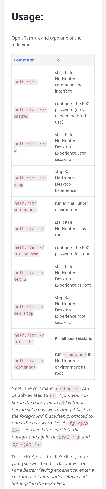

***Nethunter & kex***

### How Fix kex error
### No matching vnc server,no session,black screen,etc.

Run command from termux :

1.Download nethunter.sh and kex.sh

`https://raw.githubusercontent.com/AioonT/kex/main/kex.sh`

`https://raw.githubusercontent.com/AioonT/kex/main/nethunter.sh`

2.Setup permission

`chmod +x kex.sh`

`chmod +x nethunter.sh`

3.Move files

nethunter.sh to /data/data/com.termux/files/usr/bin

`mv nethunter.sh data/data/com.termux/files/usr/bin`

kex.sh to /usr/bin (directory of user : kali)

`mv kex.sh /data/data/com.termux/files/home/kali-arm64/usr/bin`

_____________________________________________________________________

5.Commands

 `nethunter kex start` #To start 

 `nethunter kex stop` #To stop

 `nethunter kex status` #To show status

 `nethunter kex restart` #To fix errors by removing some files

 `nethunter kex reset` #To delete some files and vnc user (.passwd fille of vnc)
 
________________________________________________________________________________

Audience: People who use Kali nethunter rootless - Android (also all kex user) 

Nethunter is a program to start Kali linux in termux and kex client program for managing vnc connection.

### kex.sh

Location : /usr/bin/kex 

Description : A program to start,**repair**,stop,manage,reset configuration files of kex.

Prerequisites : A termux installed with kali nethunter rootless 

Usage : # In termux

        $ nethunter kex <option>

        # Inside kali command line 

        ┌──(kali㉿localhost)-[~]└─
        $ kex <option>

### nethunter.sh 

Location : /data/data/com.termux/files/usr/bin/nethunter

Description : A program to start kali linux installed on termux

Prerequisites : A termux installed with kali nethunter rootless

Usage : Entering **nethunter** or **nh** in termux which open kali command line. 
 
Example :$nethunter

 ┌──(kali㉿localhost)-[~]
└─$

Modified (new) version of **nethunter** and **kex** 
_________________________________________________________________________________

Kali rootless : https://www.kali.org/docs/nethunter/nethunter-rootless/
Kali Nethunter : https://www.kali.org/docs/nethunter/
Kali NetHunter (Rootless Edition) : https://gitlab.com/kalilinux/nethunter/build-scripts/kali-nethunter-project/-/blob/master/nethunter-rootless/README.md

i.Possible kex error due to updating which remove necessary files for kex because treating it as a obsolete.

ii.Deletion of configuration files like xstartup

